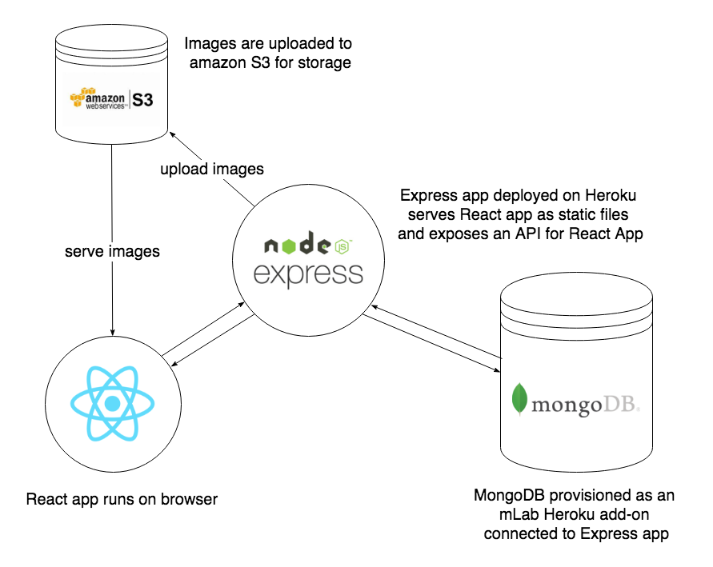
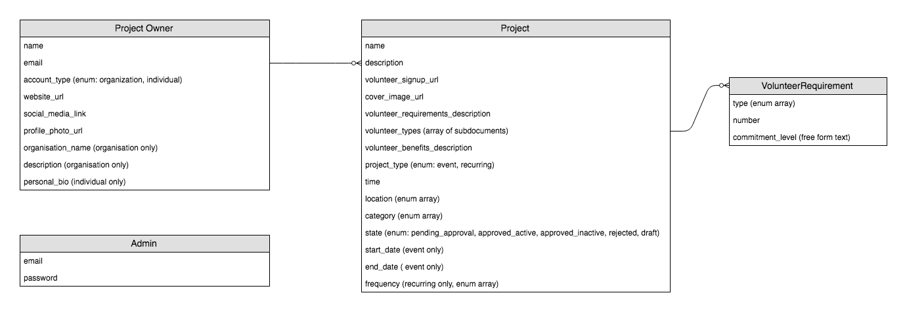
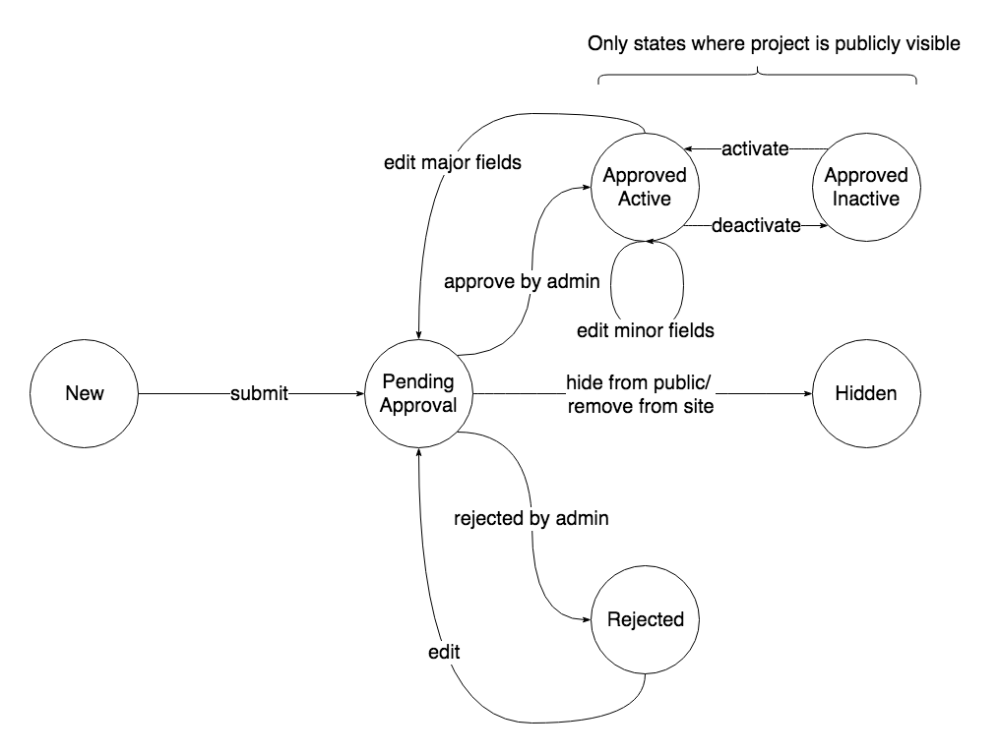

# SSN App
- Built with:
  - Create React App + Material UI
  - NodeJS + Express
  - MongoDB with Mongoose
  - PassportJS for authentication + authorization

## Local Setup
First, ensure that you have NodeJS v8.11.3 and npm v6.1.0 installed (do this through [asdf](https://github.com/asdf-vm/asdf) on Linux and macOS, or [Chocolatey](https://chocolatey.org/) on Windows). NodeJS v8.11.3 comes with npm v5.6.0 by default so you will have to upgrade npm by doing:

```bash
npm i -g npm@6.1.0
```

Some of the dependencies used in this project also require Python to be installed. Again, do this through asdf on Linux and macOS or Chocolatey on Windows. Note that if you are using Windows with a Linux subsystem you can also use asdf.

---

Install dependencies
 ```
 npm i
 ```

Create .env files within `client` and `server` folders. Copy over `.env.sample`:
```
# inside client
cd client
cp .env.sample .env

# inside server
cd ../server
cp .env.sample .env
```
Open up the `.env` files in your editor and fill in any missing values.

For the `DATABASE_URI` you have to either [set up mongodb locally](https://docs.mongodb.com/manual/installation/#mongodb-community-edition), or you can provision a database using the [mlabs free tier](https://mlab.com/). If you set up MongoDB locally, your `DATABASE_URI` will look something like `mongodb://@<host-name>:port</your-database-name>`.

For the `MONGO_USERNAME`, use the username of the user you have given access to your DB. This is NOT required if you are using your local database as MongoDB does not have access control by default.

For the `MONGO_PASSWORD`, use the password of the user you have given access to your DB. This is NOT required if you are using your local database as MongoDB does not have access control by default.

For the `AUTH_SECRET`, you can use a secure random string generated [here](https://www.grc.com/passwords.htm)

For the `AWS_BUCKET_NAME`, you have to create an AWS account and create a new S3 bucket, and use its name.

For the `AWS_ACCESS_KEY_ID` and `AWS_SECRET_ACCESS_KEY`, you have to create an AWS Identity and Access Management (IAM) user with programmatic access. When creating this user add it to a group with an AmazonS3FullAccess policy.

---

Start the server
 ```
 npm run server
 ```

 In a separate terminal start the client
 ```
 npm run client
 ```

 Note that since the `HTTPS` environment variable is set to `true` for the client, when you open the React app at `https://localhost:3000`, your browser will show you a warning that the connection is not private or is insecure. This is because the webpack dev server serving up the React app is using a default self-signed certificate that is not trusted by your computer. Just ignore the browser's warning and proceed to load the URL anyway.

 The reason that we are enabling HTTPS on the dev server is that we are sending secure cookies to the server, and secure cookies can only be sent over HTTPS.


## Workflow and Check-in Dance
When you start work on a new feature, check that the build is green, check your current git status, pull the latest code from master and branch out. Let's stick to the convention of naming our feature branches `feature/<feature-you-are-developing>`, eg. `feature/project-image-upload`:

```bash
# Check your current git status. Make sure you're on master
git status
# If your git status ia good and clean, first check the build
# If the build is green, you are good to go
# Pull the latest changes with the rebase option to reduce noisy merge commits
git pull
# Checkout to a new branch
git checkout -b feature/<feature-you-are-developing>
```

You can push up your branch to the remote while working on it.
```bash
git push -u origin <your-branch-name>
```
 A build will run on CI whenever you push new code to the remote branch. This runs the linter and the tests.

 A good habit to develop is to run the linter and fix linting errors as well as run the tests and fix failing tests locally before pushing to the remote:
 ```bash
 npm run lint
 # this will complain if there are errors
 # if there are errors, fix them!

 npm t
 # or, if you like to type, `npm run test`
 # if your tests are failing, fix them!
 ```

 After you've pushed the first time and set the upstream branch with the `-u` flag, you can just do

 ```bash
 git push
 ```

 and you will push your local commits to the appropriate remote branch.

 When your feature is complete and you are ready to merge it back to master, open a Pull Request (PR) on Github. Opening a PR will notify other collaborators that your code is awaiting review and approval for merging into master.

 You'll want to pull the latest master, rebase your branch onto master and push up your branch again before opening a PR:

 ```bash
 # checkout to master
 git checkout master
 # pull the latest master
 git pull

 # checkout to your feature branch
 git checkout <your-branch-name>
 # rebase onto master
 git rebase master
 # your branch commits will now be replayed
 # on top of any new commits that have been
 # added to master since your branch diverged
 # from master

 # push your branch
 git push
 ```

 Once other collaborators have reviewed your code and approved your changes, you can merge your remote branch to master and delete the branch, which will close the PR. If your changes were not approved or if the build for your branch is red, make and push up the appropriate fixes and ask for review again.


## Deployment

This app will be deployed on Heroku, a Platform as a Service (PaaS). The deployed Express app will serve the React App directly to the browser as static files (we are not deploying the React App on a separate server).

## Architecture

This is a simple 3-tier application with a front-end React app, back-end Express server exposing an API for the front-end app, and MongoDB as the database. We save uploaded images on Amazon S3.



### Entity Relationship Diagram (ERD)



### Project State Machine




## Notes
### Continuous Integration (CI) with Travis
We use https://travis-ci.com/ to build and test our code continuously.

As part of the build script, we run `npm run lint` and `npm test`.

TravisCI also manages auto-deployments to our staging environment https://ssn-app-staging.herokuapp.com/ after successful builds.

### ESLint
We use [ESLint](https://eslint.org/) to lint our code and highlight any syntax or stylistic errors. This helps us to easily stick to a set of conventions in our code across the team and minimize errors caused by small and annoying things like typos etc. that are sometimes hard to spot by eye. ESLint is also capable of autofixing simple errors (eg. extra whitespaces, newlines, missing semicolons etc.) Our ESLint rules can be configured in a `.eslintrc.json` file (we have one for the client code and one for the server code).

### Client

#### React
In Create React App, we can enable absolute imports by setting the `NODE_PATH` environment variable. This is read by the webpack config as the root path to resolve modules from. To add environment variables in development, add them to a `.env` file (see [here](https://github.com/facebook/create-react-app/blob/master/packages/react-scripts/template/README.md#adding-development-environment-variables-in-env))


### Server
#### Babel
We are using [babel 7](https://babeljs.io/) to transpile the server code to support ES6 imports (to normalize the code written on the client and server side). [`babel-plugin-module-resolver`](https://github.com/tleunen/babel-plugin-module-resolver) is used to allow us to resolve absolute imports from a certain root path (so that our imports are less fragile). For ESLint to recognize these absolute imports (instead of highlighting them as errors), we need to use [`eslint-plugin-import`](https://github.com/benmosher/eslint-plugin-import) and  [`eslint-import-resolver-babel-module`](https://github.com/tleunen/eslint-import-resolver-babel-module) with the appropriate configuration in our `.eslintrc.json`.

#### Express
* Handling async errors - see [here](https://strongloop.com/strongblog/async-error-handling-expressjs-es7-promises-generators/#usinges7asyncawait)

### MongoDB

Starting the mongodb server:

```
mongod --dbpath <path-to-database>
```

If MongoDB was installed via Homebrew the default path is `/usr/local/var/mongodb`. The default `dbpath` of the `mongod` command is `/data/db`.

Connect to the database with the `mongo` shell:

```
mongo
```

To use a new database in the shell, run:

```
use <my-new-db-name>
```

The database will not actually be created until records are saved to it.

See [the docs](https://docs.mongodb.com/manual/core/databases-and-collections/).

To see a list of all database:

```
show dbs
```

To show the current database:

```
db
```

To show all the collections in the current database:

```
show collections
```

### Authentication (with PassportJS and JSON Web Tokens (JWTs))
We are using JSON Web Token (JWT) for authentication. On user signup or login, a JWT is created with user information in the payload and signed using a server-side secret combined with the user's hashed password and last logout time. Signing with the hashed password and last logout time basically invalidates any tokens issued before a password reset or a logout, preventing an attacker who manages to steal the token from using it after the user has done any of the above. This addresses the issue of token revocation with stateless authentication (stateless meaning we are not storing any session or token validity info on the server-side).

The JWT is sent to the client in a httpOnly and secure cookie. Using a httpOnly cookie prevents client-side JavaScript from accessing the token (so the token cannot be leaked by a Cross-Site Scripting (XSS) attack where malicious JavaScript tries to execute on our site), and setting it as secure ensures that the cookie can only be sent over HTTPS (meaning it is encrypted). HTTPS is required because once the token is sent over the wire without encryption, any man-in-the-middle could still sniff the traffic and steal the token.

Whenever the client makes a authenticated request, it sends the cookie containing the JWT with the request, and the server verifies its signature using its secret key and the claimed user's hashed password and last logout time.

Note that using the Fetch API, the `credentials` option has to be set for cookies to be sent.

Resources:
- [100% Stateless with JWT (section about CSRF protection when using JWT for auth)](https://youtu.be/67mezK3NzpU)

### CSRF Protection
To protect against a web vulnerability called Cross-Site Request Forgery (CSRF, find out more about it [here](https://www.owasp.org/index.php/Cross-Site_Request_Forgery_(CSRF)), [here](https://www.youtube.com/watch?v=vRBihr41JTo), [here](https://steveltn.me/understanding-csrf-tokens-1a3b7bb02d87), and [here](https://stackoverflow.com/questions/20504846/why-is-it-common-to-put-csrf-prevention-tokens-in-cookies)), we use CSRF tokens to verify requests hitting our server's REST API. Because we're using JWTs for authentication, we combine CSRF tokens with JWTs for a stateless anti-CSRF protection mechanism (stateless meaning we don't have to store any session information backed by a database). The first link under resources describes this method in more detail.

Basically, when the client initiates a login request, the server returns:
1. a JWT in a httpOnly cookie, with the CSRF token as part of the JWT payload,
2. the CSRF token in the response headers
The client takes the CSRF token from the response headers and saves it in `localStorage`. Then, it sends the token back to the server in every request as part of a custom `CSRF-Token` HTTP header. The server verifies this token against the token inside the JWT payload for every authenticated route.

Some facts to be aware of to understand why this protection mechanism is used:
1. Browsers implement a [Same-origin policy](https://developer.mozilla.org/en-US/docs/Web/Security/Same-origin_policy) (SOP) that prevents cross-origin requests from reading the responses of the server, but does not prevent cross-origin requests from writing to the server (eg. POST requests). Thus, SOP alone does not prevent CSRF attacks, even if our server does not use CORS (all cross-origin requests are restricted by SOP), or uses Cross-Origin Resource Sharing (CORS) correctly configured to accept cross-origin requests only from trusted domains. To reiterate, SOP does not prevent a malicious cross-origin request from altering state on our server. For more, see [here](https://security.stackexchange.com/questions/145013/when-does-the-same-origin-policy-prevent-a-request-from-being-sent)
2. Browsers implement a [Cross-Origin Resource Sharing (CORS)](https://developer.mozilla.org/en-US/docs/Web/HTTP/CORS) mechanism to allow secure cross-origin requests. CORS allows servers to opt in to tell the browser what kinds of cross-origin requests it accepts with certain specific response headers. Under CORS, requests are either simple (sent straight to the server), or preflighted with a request by the OPTIONS HTTP method to determine the server's CORS policies. Certain things properties of the request (HTTP method used, headers being set) determine whether it is simple or preflighted.
3. AJAX requests (like the ones made by our React client using the Fetch API, or using the XMLHttpRequest (XHR) API) with custom headers will be preflighted. The browser will never send the custom headers in the initial OPTIONS request. Thus under the SOP and CORS mechanisms, a malicious cross-origin request can never be made with custom headers (it will be rejected after the preflight request).
4. From no. 3, theoretically simply setting any kind of custom header to some static value would give us CSRF protection, but [relying on the bare minimum of protection is not ideal](https://security.stackexchange.com/questions/182359/can-checking-http-headers-protect-against-csrf), and it's more secure to set the custom header to a non-guessable value, hence the CSRF token.

Resources:
- [100% Stateless with JWT (section about CSRF protection when using JWT for auth)](https://youtu.be/67mezK3NzpU?t=39m6s)
- [https://stackoverflow.com/questions/20504846/why-is-it-common-to-put-csrf-prevention-tokens-in-cookies](https://stackoverflow.com/questions/20504846/why-is-it-common-to-put-csrf-prevention-tokens-in-cookies)
- [https://stackoverflow.com/questions/36980058/do-cookies-protect-tokens-against-xss-attacks](https://stackoverflow.com/questions/36980058/do-cookies-protect-tokens-against-xss-attacks)

### Nodemailer
We are using nodemailer connected to a Gmail SMTP server through OAuth2 to send emails. Establishing the OAuth2 connection to the Gmail server requires us to obtain the `clientId` and `clientSecret` from the [Google Cloud Platform console](https://console.cloud.google.com/) and the `refreshToken` from [Google OAuth Playground](https://developers.google.com/oauthplayground) (these will be stored in the `.env` file)

[This stackoverflow answer](https://stackoverflow.com/questions/24098461/nodemailer-gmail-what-exactly-is-a-refresh-token-and-how-do-i-get-one) gives a good step-by-step overview of how to obtain the above information, although the answer is somewhat old and some of the steps are slightly outdated, overall the steps are more or less the same.

The sender email address will always be the same as the email of the user under which the project with the API credentials was created.